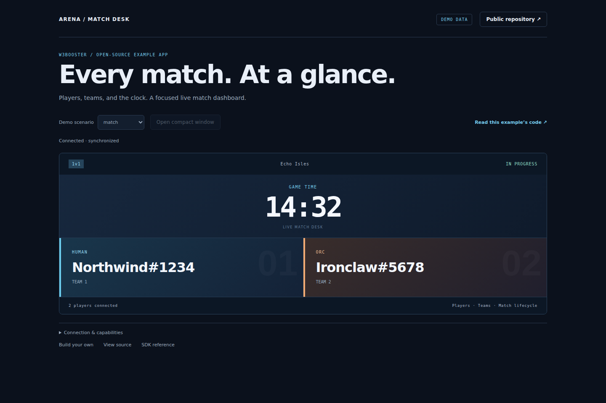

# W3Booster Developer Lab

A complete TypeScript starter and five small examples for building Warcraft III apps. The first run uses demo data: no account, Warcraft III, database, or desktop client is needed.

[Try the demo](https://w3booster.github.io/app-examples/?demo=1) · [First-app tutorial](https://website.w3booster.com/developer/first-app/) · [SDK docs](https://website.w3booster.com/developer/)



## Create your own app

Install Node.js 22.22.3 or newer, then:

```sh
npx --yes --package=github:W3Booster/app-examples w3booster-create my-app
cd my-app
npm install
npm run dev
```

Open **http://localhost:5173/**. You should see two players, a running game clock, and a **DEMO DATA** badge. Change a name or heading in `src/main.ts` and save to see the update.

Alternatively, clone this repository and run `npm ci` followed by `npm run dev`. Use `npm run build` for a production bundle in `dist/`, and `npm run preview` to inspect it locally. The server uses a strict port so a conflicting process produces an explicit error instead of silently changing the URL.

## Learn one feature at a time

| Example | Open locally | Source | What it teaches |
| --- | --- | --- | --- |
| Match dashboard | `/` | `src/examples/dashboard.ts` | Initial state, players, clock, no-match state |
| Resources and heroes | `/?view=resources` | `src/examples/resources.ts` | Scopes, optional data, missing-data UI |
| Settings | `/?view=settings` | `src/examples/settings.ts` | Host capability discovery and acknowledged writes |
| Stream overlay | `/?view=overlay` | `src/examples/overlay.ts`, `src/style.css` | Transparent broadcast strip and a shared data runtime |
| Compact window | `/?view=compact` | `src/main.ts` | Host-mediated child windows |

The demo scenario selector covers a normal match, no match, missing optional data, teams, and a finished match. `Connection & capabilities` shows the SDK status, synchronization, data capabilities, host capabilities, and definition revision. In browser DevTools, switching Network to Offline lets you exercise a **live** connection's reconnection behavior; demo mode deliberately has no network transport.

Host actions are disabled in the standalone demo because there is no authenticated W3Booster host. Demo data is never silently substituted for a failed live connection. The demo fixture module loads only when demo mode is selected.

## Connect real data

1. Enable Developer Mode from the W3Booster account menu. Open **Apps → Developer → Create app**.
2. Create a private application with the surfaces and scopes in `app-definition.json`. Use your own app name and URLs. The API accepts localhost for development; publishing needs your deployed HTTPS URLs.
3. Add the `display.title` text setting with the default from `app-definition.json`, or adapt the settings example to your schema.
4. Copy the generated client ID and bind this project:

   ```sh
   npx w3booster-settings init YOUR_CLIENT_ID --endpoint https://api.w3booster.com
   ```

5. Commit `src/w3booster.generated.ts` and the updated `package.json`. The client ID is public; user launch credentials are managed by the SDK.
6. Start the app, then select **Test locally** in W3Booster. Set the application URL to `http://localhost:5173/?demo=0` and overlay URLs to `http://localhost:5173/?view=overlay&demo=0`.
7. Open the app through W3Booster. You should see **LIVE CONNECTION** and **Connected · synchronized**. No active game is a successful connection with a waiting state.

After changing the app definition, run `npm run w3booster:sync`. Use `npm run w3booster:check` in connected CI. Synchronization is explicit so normal installs and builds do not require platform availability. Pass `--install-hooks` to the SDK init command only if you want automatic network refreshes.

Opening localhost directly does not authorize live data. Start a new local test when its 12-hour session expires. Use paths or query parameters for routing: URL fragments belong to SDK authorization. UI hot updates preserve the existing runtime and clean up old UI subscriptions. After changing a generated definition, reopen the app for a new runtime. A full page reload may also require reopening from W3Booster because launch credentials are short-lived; do not copy or persist them yourself.

## Deploy and share

Deploy `dist/` to an HTTPS static host. Relative asset URLs support a subdirectory such as GitHub Pages. Configure your registered surface URLs with `?demo=0`; the public demo link uses `?demo=1`. Do not put user credentials in environment variables, source, screenshots, or static bundles.

The default starter definition is an **unregistered demo placeholder**. New projects always receive that placeholder and never inherit the official examples' identities.

The official catalog contains four separately registered apps: **Match Dashboard**, **Resource Monitor**, **Settings Playground**, and **Clean Overlay**. Enable Developer mode in W3Booster, open **Apps → Examples**, and install/open one to use live data and host actions. Their URLs select an app with `?app=match-dashboard`, `?app=resource-monitor`, `?app=settings-playground`, or `?app=clean-overlay`, alongside `view` and `demo`. Query parameters are preserved in child windows.

`examples.json` tracks their public definitions; `src/registered/` contains SDK-generated bindings. Maintainers run `npm run examples:sync` after staging the corresponding platform records. `npm run examples:check` verifies the checked-in output offline. CI publishes `example-bindings.json` with the app build so the platform reapply script can check revisions before publishing catalog entries.

The private platform repository supplies `pnpm reapply:developer-examples` to restore these four curated entries after a database load. It uses stable client IDs, so a normal reapply does not require rebuilding the public app. Database credentials and registration remain outside browser code and public CI.

Apps are sandboxed browser pages. The SDK provides no arbitrary filesystem, shell, or process API. Settings persistence and supported window operations go through the authenticated host. OBS uses the user's stable W3Booster compositor URL, not an app launch URL.

For a larger Angular production reference, see [Match Vision](https://github.com/W3Booster/app-match-vision).

## Verify

Each registered app has a distinct visual design: a navy match desk, a light
resource ledger, a violet settings workbench, and a broadcast-overlay studio.
Every app header links directly to this public repository and its focused source
module. The pure overlay surface intentionally keeps controls out of the output.

Regenerate the four catalog screenshots with `npm run screenshots`. This captures
the actual built interfaces using deterministic demo data, not mockup images.
The files live at `docs/match-dashboard.png`, `docs/resource-monitor.png`,
`docs/settings-playground.png`, and `docs/clean-overlay.png`; each app also has
its own SVG icon in `public/icons/`.

Match Vision appears separately as the **reference implementation** in W3Booster's
Examples section. It is the existing production app, also present in the library,
with one shared installation, settings, and ratings—not another registration.

```sh
npm run check
npm run build
npx playwright install chromium
npm run test:browser
```

CI checks types, generator behavior, production builds, and visible browser output for every example and scenario against the **published SDK package**. `src/main.ts` owns startup and teardown, `src/scenarios.ts` owns test data, and `src/examples/` contains the feature code. Keep framework lifecycle and presentation decisions in your app.

Code is MIT licensed. No Warcraft artwork is bundled.
